# Implementation Plan — ChatApp Server (Backend API)

> **Source design:** [TDD-ChatApp-Server.md](TDD-ChatApp-Server.md)
> **Stack:** Node.js + TypeScript + Express + Mongoose · MongoDB Atlas · Vercel serverless
> **Author:** Gayathrini · **Date:** 2026-06-05 · **Status:** Ready to execute

An ordered, executable build sequence for the ChatApp server. Each phase is a **self-contained,
build-green increment** (`tsc` clean + tests passing) with explicit acceptance criteria and
verification. Use it as a checklist — every acceptance item is a `- [ ]` box.

---

## 1. How to use this plan

- Build **in phase order**. Every phase must `typecheck`, `build`, and keep tests green before the
  next begins.
- Work **layer-then-feature**: lay the foundation (scaffolding → cross-cutting → data model →
  auth), then add features as vertical slices (`routes → controller → service → model`), each with
  integration tests.
- Develop **against an in-memory Mongo** (`mongodb-memory-server`) and a **local storage adapter**
  (§8) — **no Atlas or Vercel Blob is needed until deployment (Phase 9)**. This keeps the whole
  server buildable and testable offline.
- Keep the Chat API **contract-faithful** to the app TDD §7 (Phase 8 contract tests enforce this).
- **Out of scope** (do not build here): the AI middleware analytics schema
  (`ui_events`/`guidance_*`/`stuck_detections`) — that lives in the Lumen backend.

---

## 2. Guiding principles (from the TDD)

| Principle | Source |
|---|---|
| Layered `routes → controller → service → Mongoose model` | TDD §4.1 |
| `createApp()` factory; `api/index.ts` Vercel entry; `/api/(.*)` rewrite | TDD §4.2 |
| **Cached Mongoose connection** per warm instance (critical) | TDD §4.3 |
| zod-validated env at boot; zod request validation | TDD §4.5, §9.2 |
| Standard error envelope + typed `AppError` | TDD §5.1, §9.2 |
| JWT auth, bcrypt, **rotating hashed** refresh tokens, admin separation | TDD §8 |
| Stateless, polling only (no WebSocket); media to external blob | TDD §3.2, §3.3 |
| Services unit-tested (mocked models); routes integration-tested (supertest + memory Mongo) | TDD §11 |

---

## 3. Current state → target

**Current:** greenfield — `chatapp-server/` contains only `docs/TDD-ChatApp-Server.md`. No
`package.json`, no source.

**Target:** the project in TDD §13 — `api/index.ts` (Vercel), `src/{app,server}.ts`, `config/`,
`lib/`, `middleware/`, `models/`, `modules/{auth,profile,contacts,conversations,messages,media,
sync,admin}/`, `scripts/seed-admin.ts`, `tests/`, `tsconfig.json`, `vercel.json`, `package.json`.

---

## 4. Toolchain & dependency matrix

| Area | Package | Proposed | Notes |
|---|---|---|---|
| Runtime | Node.js | 20 LTS+ | matches the Vercel Node runtime (pin in `vercel.json`/`engines`) |
| Language | `typescript` | 5.x | `strict`, `target` ES2021+, `module` CommonJS (TDD §12.4) |
| Web | `express` | 4.x | stable/ecosystem-compatible (5.x optional) |
| ODM | `mongoose` | 8.x | with the cached-connection pattern (TDD §4.3) |
| Auth | `jsonwebtoken` | 9.x | HS256 access + admin tokens |
| Hashing | **`bcryptjs`** | 2.x | **pure-JS** — avoids native-binding build issues on serverless (prefer over `bcrypt`/`argon2`) |
| Validation | `zod` | 3.x | env + request validation |
| Logging | `pino` + `pino-http` | 9.x | structured, request-id, no PII |
| CORS | `cors` | 2.x | allow `CORS_PORTAL_ORIGIN` |
| Media | `@vercel/blob` (+ `multer` memoryStorage) | current | external blob store; see body-size caveat in §9 |
| Local run | `tsx` / `ts-node` | current | `dev` script with reload |
| Test | `vitest` + `supertest` + `mongodb-memory-server` | current | unit + integration offline |
| Quality | `eslint` + `prettier` + `@types/*` | current | |

**Scripts (package.json, TDD §12.3):** `dev`, `build` (`tsc`), `start`, `typecheck`
(`tsc --noEmit`), `lint`, `test`, `seed:admin`.

---

## 5. Phase overview

```mermaid
flowchart LR
    P0["P0 · Scaffolding\n& toolchain"] --> P1["P1 · Cross-cutting\n+ test harness"]
    P1 --> P2["P2 · Data model\n(Mongoose + indexes)"]
    P2 --> P3["P3 · Auth & authz\n(+ seed admin)"]
    P3 --> P4["P4 · Chat: profile\n+ contacts"]
    P4 --> P5["P5 · Chat: conversations,\nmessages, media, sync"]
    P5 --> P6["P6 · Admin/Portal API\n(simulation, tasks)"]
    P6 --> P7["P7 · Hardening"]
    P7 --> P8["P8 · Test & contract\nverification"]
    P8 --> P9["P9 · Vercel deploy"]
```

| # | Phase | Size | Outcome |
|---|---|---|---|
| 0 | Scaffolding & toolchain | M | Builds, runs locally, deploys to Vercel; `/healthz` 200; env+DB caching wired |
| 1 | Cross-cutting + test harness | M | Error envelope, zod validate, pino, CORS, supertest + memory-Mongo green |
| 2 | Data model | M | All Mongoose models + indexes |
| 3 | Auth & authorization | L | Participant + admin JWT, refresh rotation, `requireAuth`/`requireAdmin`, seed admin |
| 4 | Chat: profile + contacts | M | `/me`, `/contacts*` |
| 5 | Chat: conversations/messages/media/sync | L | Core participant contract (idempotent send, unread, polling) |
| 6 | Admin/Portal API | L | User/contact mgmt, **chat simulation**, tasks/task-attempts |
| 7 | Hardening | M | Rate limiting, media constraints, security, observability |
| 8 | Test & contract verification | M | Full unit/integration/contract/auth suites green |
| 9 | Vercel deployment | M | Live on Atlas + Blob; smoke tests pass |

---

## 6. Phase detail

### Phase 0 — Scaffolding & toolchain  *(M)*
- **Goal:** a building, locally-runnable, Vercel-deployable Express app with a health endpoint,
  zod-validated env, and the **cached Mongoose connection**.
- **Deps:** `express`, `mongoose`, `zod`, `typescript`, `tsx`, `@types/express`, `@types/node`,
  `dotenv`, `eslint`, `prettier`.
- **Create:** `package.json` (scripts §4), `tsconfig.json` (TDD §12.4), `.eslintrc`, `.prettierrc`,
  `.gitignore`, `.env.example`; `src/config/env.ts` (zod, fail-fast); `src/lib/db.ts` (cached
  connection, TDD §4.3); `src/app.ts` (`createApp()`: cors, json, request-id, `connectDb`
  middleware, `/api/v1` router with **`GET /healthz`** [liveness, no DB], 404 + error placeholder);
  `src/server.ts` (listen); `api/index.ts` (Vercel entry); `vercel.json` (`/api/(.*)` rewrite).
- **Acceptance:**
  - [x] `npm run typecheck` and `npm run build` succeed.
  - [x] `npm run dev` boots; `GET /api/v1/healthz` → `200` (works without a DB).
  - [x] `connectDb()` reuses one connection (cached on `globalThis`).
- **Verify:** `npm run typecheck && npm run build`; `npm run dev` + `curl localhost:3000/api/v1/healthz`.

### Phase 1 — Cross-cutting foundation + test harness  *(M)*
- **Goal:** the error envelope, validation, logging, CORS, and a green offline test harness.
- **Depends on:** P0.
- **Deps:** `pino`, `pino-http`, `cors`, `vitest`, `supertest`, `mongodb-memory-server`,
  `@types/supertest`.
- **Create:** `src/lib/errors.ts` (`AppError(code, httpStatus, message, details)` + the §5.1
  error-code catalogue); `src/middleware/error.ts` (AppError→envelope; 404; unexpected→`500
  INTERNAL`, no stack/PII leak); `src/middleware/validate.ts` (zod body/params/query → `400
  VALIDATION_ERROR` with `details`); `src/lib/logger.ts` (pino + request id); CORS config;
  `tests/setup.ts` (memory-Mongo bootstrap) + a supertest `app` helper.
- **Acceptance:**
  - [x] A sample validated route returns the **standard envelope** on bad input.
  - [x] vitest runs against in-memory Mongo (a trivial model round-trips).
- **Verify:** `npm test`.

### Phase 2 — Data model  *(M)*
- **Goal:** all Mongoose models + indexes (TDD §7).
- **Depends on:** P1.
- **Create `src/models/`:** `user`, `admin`, `contact`, `conversation` (embedded `participants`
  with per-user `unreadCount`/`lastReadAt` + denormalized `lastMessage`), `message` (`clientId`
  unique-per-conversation idempotency index, `sentAt` index), `refreshToken` (TTL on `expiresAt`),
  `task`, `taskAttempt`. Apply the §7.4 index set.
- **Acceptance:**
  - [x] Models compile; all §7.4 indexes declared.
  - [x] Unit tests: unique constraints (`username`, contacts pair, message `clientId`);
        conversation `participants.length === 2` validation.
- **Verify:** `npm test` (model tests).

### Phase 3 — Auth & authorization  *(L)*
- **Goal:** participant + admin auth, middleware, refresh rotation, admin seeding.
- **Depends on:** P2.
- **Deps:** `jsonwebtoken`, `bcryptjs`, `@types/jsonwebtoken`.
- **Create:** `src/lib/jwt.ts` (sign/verify access + admin), `src/lib/password.ts` (bcryptjs);
  `src/middleware/auth.ts` (`requireAuth`), `src/middleware/adminAuth.ts` (`requireAdmin`);
  `modules/auth/` (register, login, **refresh with rotation**, logout → `/auth/*`); admin login
  (`/admin/auth/login`); `scripts/seed-admin.ts`.
- **Acceptance:**
  - [x] Register/login issue access (~15 m) + refresh (~30 d, **hashed, rotating**); logout revokes.
  - [x] `401 TOKEN_EXPIRED` path; on refresh the old token is rejected (rotation).
  - [x] `requireAuth`/`requireAdmin` enforced; **participant token rejected on `/admin/*`**.
  - [x] `seed:admin` creates a researcher account.
- **Verify:** `npm test` (auth unit + integration); run `npm run seed:admin` against memory/local.

### Phase 4 — Chat API: profile + contacts  *(M)*
- **Goal:** `/me` and `/contacts*`.
- **Depends on:** P3.
- **Create:** `modules/profile/` (`GET`/`PATCH /me`); `modules/contacts/`
  (`GET`/`POST`/`PATCH`/`DELETE /contacts`, with `409 DUPLICATE_CONTACT`).
- **Acceptance:** [x] profile get/update; [x] contacts CRUD + duplicate dedupe.
- **Verify:** `npm test` (supertest integration).

### Phase 5 — Chat API: conversations, messages, media, sync  *(L)* — core participant contract
- **Goal:** the heart of the Chat API (TDD §5.4–5.6).
- **Depends on:** P4.
- **Deps:** `@vercel/blob`, `multer`.
- **Create:** `modules/conversations/` (list; **idempotent** create `200`/`201`; delete; `read`);
  `modules/messages/` (since-pagination; **send with `clientId` idempotency** → `SENT`, recipient
  `unreadCount++`, `lastMessage` denormalized); `modules/media/` (multipart → storage adapter →
  `{mediaId,url}`); `modules/sync/` (`GET /sync?since=` → changed conversations + messages +
  `serverTime`). Add `src/lib/storage.ts` (`StorageAdapter` with a Blob impl + a **local fake**,
  §8).
- **Acceptance:**
  - [x] Conversations list/create(idempotent)/delete/read.
  - [x] Send: replay on `clientId` returns the existing message (`409`/dedupe); unread + lastMessage
        updated; response includes **`senderId`**.
  - [x] `GET messages?since=` and `/sync` return correct windows + `nextCursor`/`serverTime`.
  - [x] Media upload returns `{mediaId,url}`; `IMAGE` message references it.
- **Verify:** `npm test` (integration + a first contract check vs app TDD §7).

### Phase 6 — Admin / Portal API  *(L)*
- **Goal:** the researcher surface (TDD §6), centered on **chat simulation**.
- **Depends on:** P5.
- **Create `modules/admin/`:** users (list/create/get/patch/reset-password); contacts on behalf
  (`reciprocal?`); conversations (ensure; monitor; **simulation** `POST /admin/conversations/:id/
  messages {asUserId}` with `senderId = asUserId` + authz that `asUserId` is a participant); tasks
  + task-attempts (assign; `status`/`metrics`).
- **Acceptance:**
  - [x] User + contact management on behalf of participants.
  - [x] **Simulation reflected end-to-end:** an integration test sends as `asUserId` and asserts it
        appears in the recipient's `GET /conversations/:id/messages?since=`.
  - [x] **act-as-user authz:** `asUserId` must be a participant; a participant token cannot simulate.
  - [x] Tasks + task-attempts persist `status` and `metrics`.
- **Verify:** `npm test` (admin integration incl. the simulation→poll reflection).

### Phase 7 — Hardening: rate limiting, media constraints, security, observability  *(M)*
- **Goal:** TDD §9, §10 across the API.
- **Depends on:** P6.
- **Tasks:** rate-limit auth endpoints (**serverless caveat:** in-memory limiters don't span
  instances → Upstash Redis in prod, or best-effort for the lab); enforce **media constraints**
  (≤5 MB; `image/jpeg|png|webp`; reject `413`/`415`) and decide the **upload path** given Vercel's
  request-body limit (§9); security pass (no secrets/PII/tokens in logs, HTTPS, JWT-secret
  handling); structured logging + request ids; verify env completeness (§12.5).
- **Acceptance:**
  - [x] Oversized/invalid media rejected; auth endpoints rate-limited; logs scrubbed.
- **Verify:** targeted tests + manual.

### Phase 8 — Test & contract verification  *(M)*
- **Goal:** pin the contract and behaviour (TDD §11).
- **Depends on:** P7.
- **Tasks:** complete **unit** (services with mocked models — auth, idempotent send, conversation
  idempotency, act-as-user authz, sync windowing); **integration** (supertest + memory-Mongo) for
  every endpoint; **contract tests** asserting shapes/status match app TDD §7 (incl. `senderId`);
  **auth/security tests**. CI script: `npm run typecheck && npm run lint && npm test`.
- **Acceptance:**
  - [x] All suites green; every app TDD §7 endpoint has a passing contract test.
  - [x] The simulation→participant-poll path is covered.
- **Verify:** `npm test` (full).

### Phase 9 — Deployment (Vercel)  *(M)*
- **Goal:** go live (TDD §14).
- **Depends on:** P8.
- **Runbook:** step-by-step instructions + copy-paste smoke test in
  [Deployment-Runbook.md](Deployment-Runbook.md). The codebase is deploy-ready (`vercel.json`,
  `api/index.ts`, cached connection, production env guards); this phase is **manual** — it needs
  live Atlas/Vercel/Blob credentials and cannot be executed offline/CI.
- **Tasks:** create **Atlas** cluster + DB user + network access; provision **Vercel Blob** (token);
  import the project, confirm the `/api/(.*)` rewrite; set all **§12.5 env vars** per environment;
  deploy; run `seed:admin` against prod; **smoke test** (`/healthz`, register/login, send, `/sync`,
  admin login, simulation).
- **Acceptance:**
  - [ ] Deployed; smoke tests pass against the live URL. *(execute via the runbook when ready)*
- **Verify:** `vercel deploy` (or Git push) + `curl` smoke tests.

---

## 7. Testing & Definition of Done

- **Unit (Vitest, mocked models):** auth (hash/verify, rotation), message send (idempotency, unread),
  conversation idempotency, act-as-user authz, sync windowing.
- **Integration (supertest + `mongodb-memory-server`):** every endpoint, request→DB→response;
  **admin simulation reflected in a participant's `?since=` poll**.
- **Contract:** response shapes/status codes match app TDD §7 (incl. `senderId`).
- **Definition of Done:** all phase acceptance boxes ticked; `typecheck` + `lint` + `test` green;
  the three study tasks supported (send/photo/delete) and the simulation path tested; deployed with
  passing smoke tests.

---

## 8. Local-development strategy (no external services until P9)

- **Database:** develop and test against **`mongodb-memory-server`** (or a local Docker MongoDB).
  Atlas is only required at Phase 9.
- **Storage:** code to a `StorageAdapter` interface (`src/lib/storage.ts`, TDD §13). Provide a
  **local fake** (writes to `/tmp`, returns a dummy `url`) for dev/tests and the **Vercel Blob**
  implementation for production — selected by env. This is the server analog of the app's
  "fake-API-first" approach: the whole server builds and tests offline.

---

## 9. Risks & mitigations

| # | Risk | Mitigation | Source |
|---|---|---|---|
| 1 | **Serverless connection exhaustion** | Cached global connection; small `maxPoolSize` | TDD §4.3, §16 |
| 2 | **`bcrypt` native build on serverless** | Use **`bcryptjs`** (pure JS) | impl. note |
| 3 | **Vercel request body limit vs ≤5 MB media** | Prefer **Vercel Blob client-upload** (bypasses the function body limit) or document the size cap | TDD §9.3, §16 |
| 4 | Cold-start latency mid-session | Minimal deps; optional warm-up ping | TDD §16 |
| 5 | Rate limiting across instances | Shared store (Upstash) in prod, else best-effort | TDD §9.3, §16 |
| 6 | No cross-doc FKs in MongoDB | App-level integrity checks + indexes in services | TDD §16 |
| 7 | Secrets management | Vercel env vars; never commit; rotate JWT secrets if leaked | TDD §16 |

---

## 10. Appendix — phase → TDD traceability

| Phase | Primary TDD sections |
|---|---|
| P0 Scaffolding | §4.2, §4.3, §4.5, §12.4 |
| P1 Cross-cutting | §5.1, §9.2, §9.3 |
| P2 Data model | §7 |
| P3 Auth | §8, §6.1 |
| P4 Profile + contacts | §5.2, §5.3 |
| P5 Conversations/messages/media/sync | §5.4–5.6, §15.1 |
| P6 Admin/Portal | §6 |
| P7 Hardening | §9, §10 |
| P8 Test & contract | §11 |
| P9 Deployment | §14, §12.5 |

> **Note:** scripts assume npm (`npm run …`); pnpm/yarn are equivalents. The whole build runs
> offline against `mongodb-memory-server` + the local storage fake until Phase 9.
