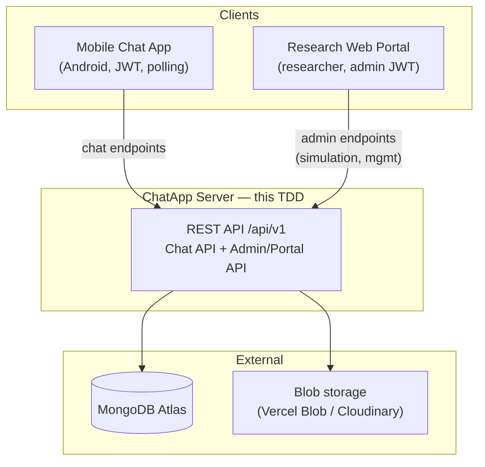
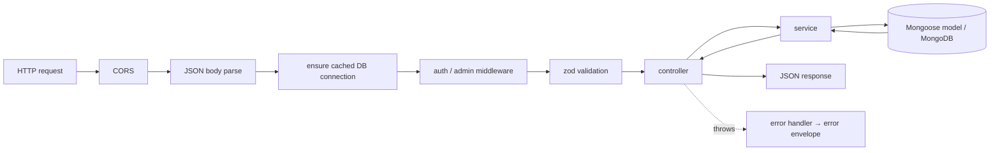
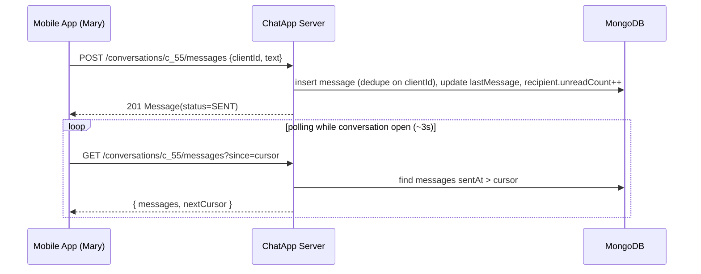
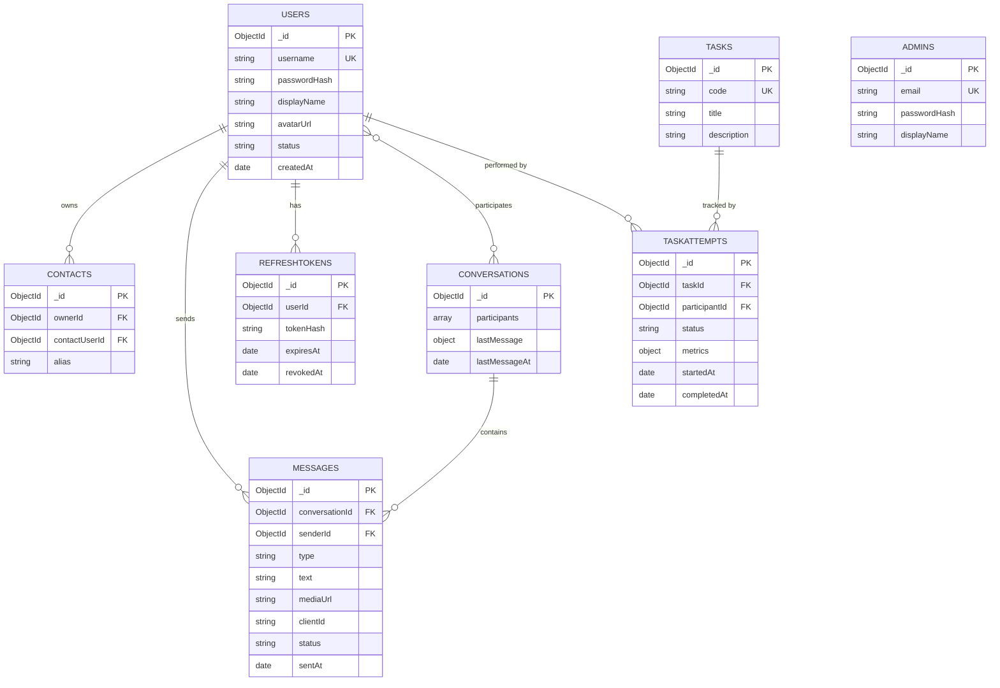

# Technical Design Document — ChatApp Server (Backend API)

> **Project:** AI-Powered, Context-Aware Assistance Middleware for Elderly Users
> **Artifact:** Backend API server — serves the mobile chat app **and** the research web portal

---

## 1. Document Control

| Field | Value |
|---|---|
| Document title | Technical Design Document — ChatApp Server (Backend API) |
| Version | 0.1 (Draft) |
| Status | For review |
| Author | Gayathrini |
| Date | 2026-06-05 |
| Applies to | `chatapp-server` (TypeScript + Express, MongoDB, Vercel) |
| Related documents | `chatapp/docs/TDD-Baseline-Chat-App.md` (defines the consumed API contract, §7); *(future)* Research Web Portal TDD; AI Middleware SDK TDD |

### 1.1 Change log

| Version | Date | Author | Summary |
|---|---|---|---|
| 0.1 | 2026-06-05 | Gayathrini | Initial draft: Chat API + Admin/Portal API, MongoDB data model, JWT auth, Vercel serverless design. |

---

## 2. Introduction

### 2.1 Purpose

This document specifies the technical design of the **ChatApp Server** — the central backend of
the research ecosystem. It **implements the REST API contract** consumed by the baseline mobile
app (defined in `TDD-Baseline-Chat-App.md` §7) and additionally provides a **research
administration / portal API** so a researcher can manage participants and **simulate the other
party** in a conversation. It is detailed enough to build the server directly.

### 2.2 Research context

During a study session the participant uses the mobile app while the **other party** (e.g.
"John" messaging "Mary") is driven by the **research web portal**, which calls this server's
admin API to *send messages as any user*. The participant's app — which receives messages by
**polling** — then surfaces them as an ordinary conversation. The server therefore has two
classes of caller:

- **Participants** (mobile app) — authenticated as a normal user (JWT).
- **Researchers** (web portal) — authenticated as an admin; may act on behalf of any user.

This server is shared by the control and experimental phases. The control (baseline) app has
**no event tracking**, so research metrics for the control are recorded by the researcher via
the portal (task-attempt tracking, §6.5), not auto-collected from the app.

### 2.3 Scope

**In scope**

- The **Chat API** consumed by the mobile app: auth, profile, contacts, conversations,
  messages (send + since-polling), media upload, sync, read receipts.
- The **Admin / Portal API**: researcher auth, user management, contact management on behalf of
  users, **chat simulation**, conversation monitoring, and research **task / task-attempt**
  tracking.
- Data model (MongoDB collections), authentication/authorization, cross-cutting concerns,
  testing strategy, build/tooling, and Vercel deployment.

**Out of scope** (other documents)

- The **AI middleware analytics schema** (`ui_events`, `guidance_sessions`, `guidance_steps`,
  `stuck_detections`, `flow/screen definitions`) and the middleware SDK — added in the
  experimental phase.
- The **web portal UI** (this document defines only the API it consumes).
- The **mobile app** internals (defined in the app TDD).
- Executing the deployment (this is a design document).

### 2.4 Definitions, acronyms, abbreviations

| Term | Meaning |
|---|---|
| TDD | Technical Design Document |
| ODM | Object-Document Mapper (Mongoose) |
| JWT | JSON Web Token |
| Access token | Short-lived JWT authorizing API calls |
| Refresh token | Long-lived opaque token used to obtain new access tokens |
| Participant | An elderly study user, authenticated via the mobile app |
| Researcher / Admin | Operator of the web portal, authenticated via the admin API |
| Simulation / "act-as-user" | Admin capability to send a message **as** a specified user |
| Cursor | A timestamp marker used for incremental polling (`since`) |
| Cold start | First request to an idle serverless instance (added latency) |

### 2.5 References

- `chatapp/docs/TDD-Baseline-Chat-App.md` — §7 (consumed API contract), §16.2 (open questions
  this document resolves).
- Mongoose + Vercel serverless connection-caching pattern; MongoDB Atlas; Vercel Node runtime.

---

## 3. System Overview

### 3.1 Context



### 3.2 Design goals and principles

1. **Contract-faithful.** The Chat API exactly satisfies the app TDD §7 so the mobile client
   builds against it unchanged.
2. **Enable the experiment.** First-class **chat simulation** and **task-attempt tracking** so a
   researcher can run sessions and collect control-group metrics.
3. **Stateless & serverless-friendly.** No in-process session state; everything in MongoDB; one
   cached DB connection per warm instance (polling, not WebSocket).
4. **Layered & testable.** `routes → controller → service → model`; services are unit-testable
   with mocked models; routes are integration-testable with `supertest` + in-memory MongoDB.
5. **Secure by default.** JWT auth, hashed passwords, rotating refresh tokens, strict input
   validation, least-privilege admin separation, HTTPS only.

### 3.3 Key constraints

- Runtime: Node.js (Vercel Node serverless functions); language TypeScript.
- Datastore: MongoDB (Atlas); ODM Mongoose.
- Delivery: **polling** only (no WebSocket) — consistent with the app TDD.
- Filesystem is **ephemeral** on Vercel → media must go to external blob storage.

---

## 4. Architecture

### 4.1 Layering and module pattern

A conventional layered Express architecture. Each feature is a **module** with a thin route
file, a controller (HTTP ↔ service), a service (business logic), and a Mongoose model:

```
routes  →  controller  →  service  →  Mongoose model  →  MongoDB
              ↑ zod          ↑ AppError
           validation     domain errors
```

| Layer | Responsibility | Must NOT |
|---|---|---|
| Route | Path + method, attach middleware (auth, validate), call controller | Contain business logic |
| Controller | Parse req → call service → shape HTTP response | Touch the DB directly |
| Service | Business rules, transactions, mapping to API DTOs | Reference `req`/`res` |
| Model (Mongoose) | Schema, indexes, persistence | Hold cross-entity business rules |

### 4.2 Application composition

- **`src/app.ts`** — an Express app **factory** (`createApp()`): registers global middleware
  (CORS, JSON body parser, request-id/logging, a **DB-connection-ensure** middleware), mounts
  the `/api/v1` routers, then the 404 + centralized error handler.
- **`src/server.ts`** — local dev entry (`createApp().listen(PORT)`).
- **`api/index.ts`** — the **Vercel serverless entry**: imports `createApp()` and exports the
  Express app as the function handler (an Express app is a valid `(req, res)` handler).
- **`vercel.json`** — rewrites all `/api/*` to the single function:

```json
{
  "rewrites": [{ "source": "/api/(.*)", "destination": "/api" }]
}
```

### 4.3 Serverless model + Mongoose connection caching (critical)

Each warm serverless instance must **reuse a single Mongoose connection** across invocations;
opening a new connection per request would exhaust Atlas connection limits. The standard pattern
caches the connection (and the in-flight connect promise) on `globalThis`:

```ts
// src/lib/db.ts
import mongoose from "mongoose";

type Cache = { conn: typeof mongoose | null; promise: Promise<typeof mongoose> | null };
const cache: Cache = (globalThis as any).__mongoose ??= { conn: null, promise: null };

export async function connectDb(): Promise<typeof mongoose> {
  if (cache.conn) return cache.conn;
  if (!cache.promise) {
    cache.promise = mongoose.connect(process.env.MONGODB_URI!, {
      bufferCommands: false,        // fail fast instead of buffering on cold start
      maxPoolSize: 5,               // keep small per instance
    });
  }
  cache.conn = await cache.promise;
  return cache.conn;
}
```

A middleware `await connectDb()` runs before route handlers so every request has a live
connection. Cold-start mitigation and Atlas sizing are covered in §9.1 and §14.

### 4.4 Request lifecycle



### 4.5 Configuration & wiring

Environment is loaded and **validated with zod at boot** (`src/config/env.ts`); missing/invalid
vars fail fast. No DI framework — modules are wired by direct imports (small surface). Services
receive models via import; tests substitute fakes/`mongodb-memory-server`.

---

## 5. Chat API (consumed by the mobile app)

Authoritative restatement of the app TDD §7 with server semantics. All paths are under
`/api/v1`. All requests/responses are JSON (except `/media` which is `multipart/form-data`).
Timestamps are ISO-8601 UTC. IDs are MongoDB ObjectId strings.

### 5.1 Conventions

- **Auth:** `Authorization: Bearer <accessToken>` on every endpoint except
  `auth/register|login|refresh`.
- **Error envelope** (all 4xx/5xx):

```json
{ "error": { "code": "INVALID_CREDENTIALS", "message": "Human-readable text", "details": {} } }
```

- **Error-code catalogue:** `VALIDATION_ERROR` (400/422), `INVALID_CREDENTIALS` (401),
  `UNAUTHENTICATED` (401), `TOKEN_EXPIRED` (401), `FORBIDDEN` (403), `NOT_FOUND` (404),
  `CONFLICT` (409), `DUPLICATE_CONTACT` (409), `PAYLOAD_TOO_LARGE` (413), `RATE_LIMITED` (429),
  `INTERNAL` (500).

### 5.2 Auth & profile

| Method | Path | Body → Response |
|---|---|---|
| POST | `/auth/register` | `{username, password, displayName}` → `201 {user, accessToken, refreshToken}` |
| POST | `/auth/login` | `{username, password}` → `200 {user, accessToken, refreshToken}` |
| POST | `/auth/refresh` | `{refreshToken}` → `200 {accessToken, refreshToken}` (rotates) |
| POST | `/auth/logout` | `{refreshToken}` → `204` (revokes) |
| GET | `/me` | → `200 User` |
| PATCH | `/me` | `{displayName?, avatarUrl?}` → `200 User` |

```json
// POST /api/v1/auth/login → 200
{
  "user": { "id": "u_6650...", "username": "mary", "displayName": "Mary", "avatarUrl": null, "status": "ACTIVE" },
  "accessToken": "eyJhbGciOi...",
  "refreshToken": "rt_b3f1...."
}
```

### 5.3 Contacts

| Method | Path | Body → Response |
|---|---|---|
| GET | `/contacts` | → `200 [Contact]` |
| POST | `/contacts` | `{username}` *or* `{userId}` → `201 Contact` (`409 DUPLICATE_CONTACT` if exists) |
| PATCH | `/contacts/:id` | `{alias}` → `200 Contact` |
| DELETE | `/contacts/:id` | → `204` |

### 5.4 Conversations

| Method | Path | Body → Response |
|---|---|---|
| GET | `/conversations` | → `200 [Conversation]` (with `peer`, `lastMessage`, `unreadCount`) |
| POST | `/conversations` | `{peerUserId}` → `200` existing **or** `201` created (idempotent, §16) |
| DELETE | `/conversations/:id` | → `204` |
| POST | `/conversations/:id/read` | `{upTo?}` → `204` (clears caller's unread, sets `lastReadAt`) |

### 5.5 Messages

| Method | Path | Body → Response |
|---|---|---|
| GET | `/conversations/:id/messages?since={cursor}&limit={n}` | → `200 {messages:[Message], nextCursor}` |
| POST | `/conversations/:id/messages` | `{clientId, type, text?, mediaId?}` → `201 Message` |
| POST | `/media` (multipart `file`) | → `201 {mediaId, url}` |

**Send semantics.** `clientId` is a client-generated idempotency key, unique per conversation
(`409 CONFLICT` / returns the existing message on replay). On success the server sets
`status: "SENT"`, stamps `sentAt`, denormalizes `lastMessage`/`lastMessageAt` on the
conversation, and increments the **recipient's** `unreadCount`.

**Message shape (server-canonical).** The server returns `senderId`; the client derives
`direction` (`INCOMING`/`OUTGOING`) by comparing `senderId` to its own user id. This refines the
abbreviated example in the app TDD §7.6 (which omitted `senderId`).

```json
// POST /api/v1/conversations/c_55/messages → 201
{
  "id": "m_991", "clientId": "9f3c-7a21-...", "conversationId": "c_55",
  "senderId": "u_john", "type": "TEXT", "text": "Hello Mary", "mediaUrl": null,
  "status": "SENT", "sentAt": "2026-06-05T09:21:00Z"
}
```

### 5.6 Sync (polling)

`GET /sync?since={cursor}` → everything visible to the caller that changed since the cursor:

```json
// GET /api/v1/sync?since=2026-06-05T09:20:00Z → 200
{
  "conversations": [ /* changed conversations with unread + lastMessage */ ],
  "messages": [ /* new/updated messages across the caller's conversations */ ],
  "serverTime": "2026-06-05T09:21:05Z"
}
```

The client advances its cursor to `serverTime`. The chat-list screen polls `/sync`; an open
conversation polls `/conversations/:id/messages?since=` (see app TDD §7.7). Cursor format is an
ISO-8601 timestamp (opaque-cursor alternative noted in §16).

### 5.7 Send & receive sequences



---

## 6. Admin / Portal API (researcher)

All paths under `/api/v1/admin`, protected by **admin** auth (§7 = data model, §8 = auth). The
"act-as-user" capability is the core research feature.

### 6.1 Admin authentication

| Method | Path | Body → Response |
|---|---|---|
| POST | `/admin/auth/login` | `{email, password}` → `200 {admin, accessToken}` |

Admin accounts are seeded/managed out-of-band (a seeding script; not self-registration).

### 6.2 User (participant) management

| Method | Path | Body → Response |
|---|---|---|
| GET | `/admin/users` | → `200 [User]` (list participants) |
| POST | `/admin/users` | `{username, displayName, password}` → `201 User` |
| GET | `/admin/users/:id` | → `200 User` |
| PATCH | `/admin/users/:id` | `{displayName?, status?}` → `200 User` (activate/deactivate) |
| POST | `/admin/users/:id/reset-password` | `{newPassword}` → `204` |

### 6.3 Contact management on behalf of users

| Method | Path | Body → Response |
|---|---|---|
| GET | `/admin/users/:id/contacts` | → `200 [Contact]` |
| POST | `/admin/users/:id/contacts` | `{contactUserId, reciprocal?}` → `201 Contact(s)` |
| DELETE | `/admin/users/:id/contacts/:contactId` | → `204` |

`reciprocal: true` also creates the mirror contact, so both participants see each other (useful
when preparing a session).

### 6.4 Conversation monitoring & chat simulation

| Method | Path | Body → Response |
|---|---|---|
| POST | `/admin/conversations` | `{participantIds:[a,b]}` → `200/201 Conversation` (ensure exists) |
| GET | `/admin/conversations?userId=` | → `200 [Conversation]` (any participant's threads) |
| GET | `/admin/conversations/:id/messages` | → `200 {messages, nextCursor}` (read any thread) |
| POST | `/admin/conversations/:id/messages` | `{asUserId, type, text?, mediaId?}` → `201 Message` |

**Chat simulation** (`POST /admin/conversations/:id/messages`): creates a message whose
`senderId = asUserId` (must be a participant of the conversation), updates `lastMessage` and the
**recipient's** `unreadCount`, exactly as a normal send would. The participant's next poll
delivers it — making the simulated party indistinguishable from a real one.

```mermaid
sequenceDiagram
    participant R as Researcher (Web Portal)
    participant API as ChatApp Server
    participant DB as MongoDB
    participant P as Participant App (Mary)
    R->>API: POST /admin/conversations/c_55/messages {asUserId: john, text:"Hello Mary"}
    API->>API: requireAdmin; assert john ∈ conversation
    API->>DB: insert message(senderId=john); update lastMessage; Mary.unreadCount++
    API-->>R: 201 Message
    loop Mary's app polling (~3s)
        P->>API: GET /conversations/c_55/messages?since=cursor  (as Mary)
        API->>DB: find messages sentAt > cursor
        API-->>P: { messages:[john→"Hello Mary"], nextCursor }
    end
```

### 6.5 Research task & task-attempt tracking

Because the **control** app has no event tracking, the researcher records evaluation outcomes
through the portal during observation.

| Method | Path | Body → Response |
|---|---|---|
| POST | `/admin/tasks` | `{code, title, description}` → `201 Task` |
| GET | `/admin/tasks` | → `200 [Task]` |
| PATCH | `/admin/tasks/:id` | `{title?, description?}` → `200 Task` |
| POST | `/admin/tasks/:id/assign` | `{participantId}` → `201 TaskAttempt(status=ASSIGNED)` |
| GET | `/admin/task-attempts?participantId=&taskId=` | → `200 [TaskAttempt]` |
| PATCH | `/admin/task-attempts/:id` | `{status?, metrics?, notes?}` → `200 TaskAttempt` |

`TaskAttempt.status ∈ {ASSIGNED, STARTED, COMPLETED, FAILED}`; `metrics` captures
`{durationMs, errorCount, helpRequests}` — the quantitative evaluation data (completion rate,
time, errors) for the control group. The three study tasks map to `Task.code` values
`SEND_MESSAGE`, `SEND_PHOTO`, `DELETE_CONVERSATION` (see §15).

---

## 7. Data Model (MongoDB / Mongoose)

### 7.1 Collections overview



### 7.2 Embedding vs referencing

- **Messages are a separate collection** (high volume, append-only, paginated) referencing
  `conversationId` — never embedded in the conversation.
- **Conversation participants are embedded** as a small fixed-size array of subdocuments
  carrying **per-user read state** (`unreadCount`, `lastReadAt`) — cheap to read with the list.
- **`lastMessage` is denormalized** onto the conversation for an efficient chat-list render.
- **Contacts are a separate collection** (queryable, supports aliases, reciprocal entries).

### 7.3 Representative schema (Mongoose, illustrative)

```ts
// src/models/conversation.model.ts
const participantSchema = new Schema({
  userId: { type: Schema.Types.ObjectId, ref: "User", required: true },
  unreadCount: { type: Number, default: 0 },
  lastReadAt: { type: Date, default: null },
}, { _id: false });

const conversationSchema = new Schema({
  participants: { type: [participantSchema], validate: (v) => v.length === 2 },
  lastMessage: {
    text: String, type: { type: String, enum: ["TEXT", "IMAGE"] },
    senderId: { type: Schema.Types.ObjectId, ref: "User" }, sentAt: Date,
  },
  lastMessageAt: { type: Date, index: true },
}, { timestamps: true });
conversationSchema.index({ "participants.userId": 1, lastMessageAt: -1 });
```

```ts
// src/models/message.model.ts
const messageSchema = new Schema({
  conversationId: { type: Schema.Types.ObjectId, ref: "Conversation", required: true },
  senderId: { type: Schema.Types.ObjectId, ref: "User", required: true },
  type: { type: String, enum: ["TEXT", "IMAGE"], default: "TEXT" },
  text: String,
  mediaUrl: String,
  clientId: { type: String, required: true },
  status: { type: String, enum: ["SENT", "DELIVERED", "READ"], default: "SENT" },
  sentAt: { type: Date, default: () => new Date(), index: true },
}, { timestamps: true });
messageSchema.index({ conversationId: 1, sentAt: 1 });
messageSchema.index({ conversationId: 1, clientId: 1 }, { unique: true }); // idempotency
```

### 7.4 Index summary

| Collection | Index | Purpose |
|---|---|---|
| users | `{username:1}` unique | login + uniqueness |
| admins | `{email:1}` unique | admin login |
| contacts | `{ownerId:1, contactUserId:1}` unique | dedupe contacts |
| conversations | `{participants.userId:1, lastMessageAt:-1}` | chat-list + sync |
| messages | `{conversationId:1, sentAt:1}` | history + `since` polling |
| messages | `{conversationId:1, clientId:1}` unique | send idempotency |
| refreshTokens | `{tokenHash:1}` unique; `{expiresAt:1}` TTL | lookup + auto-expiry |
| taskAttempts | `{participantId:1, taskId:1}` | metrics queries |

---

## 8. Authentication & Authorization

### 8.1 Participant auth (JWT)

- **Passwords** hashed with **bcrypt** (cost ≥ 10); never stored or logged in plaintext.
- **Access token:** signed JWT (HS256), payload `{ sub: userId, typ: "access" }`, lifetime
  **~15 min**.
- **Refresh token:** opaque random string; only its **hash** is stored (`refreshTokens`),
  lifetime **~30 days**, **rotated** on each `/auth/refresh` (old one revoked). TTL index
  auto-purges expired tokens.
- On `401 TOKEN_EXPIRED`, the client refreshes once; if refresh fails it logs out.

```mermaid
sequenceDiagram
    participant App
    participant API
    participant DB
    App->>API: POST /auth/login {username, password}
    API->>DB: find user; bcrypt.compare
    API->>DB: store hash(refreshToken)
    API-->>App: {user, accessToken(15m), refreshToken(30d)}
    Note over App,API: access token later expires
    App->>API: POST /auth/refresh {refreshToken}
    API->>DB: find hash; assert not revoked/expired
    API->>DB: revoke old; store new hash (rotate)
    API-->>App: {accessToken, refreshToken}
```

### 8.2 Researcher/admin auth & "act-as-user"

- **Admins** are a separate collection with their own login; admin access token carries
  `{ sub: adminId, typ: "admin" }`.
- `requireAuth` middleware authorizes participant endpoints; `requireAdmin` authorizes
  `/admin/*`. They are distinct — a participant token can never reach admin routes.
- **act-as-user authorization:** only an authenticated admin may set `asUserId`; the service
  asserts `asUserId` is a participant of the target conversation before writing. Participants
  can never spoof a `senderId`.

---

## 9. Cross-Cutting Concerns

### 9.1 Configuration, DB sizing, cold starts

- Env validated at boot (`MONGODB_URI`, `JWT_ACCESS_SECRET`, `JWT_REFRESH_SECRET`,
  `BLOB_*`/`CLOUDINARY_*`, `CORS_PORTAL_ORIGIN`, token TTLs).
- `maxPoolSize` kept small (≈5) per serverless instance; connection cached (§4.3).
- Cold starts add latency to the first request; mitigations: minimal dependencies, lazy heavy
  imports, and (optional) a scheduled warm-up ping during study sessions.

### 9.2 Validation & errors

- **zod** schemas validate body/params/query in a `validate(schema)` middleware; failures →
  `400 VALIDATION_ERROR` with `details` listing offending fields.
- A typed `AppError(code, httpStatus, message, details?)` is thrown by services and mapped to
  the **error envelope** by a single error-handling middleware. Unexpected errors → `500
  INTERNAL` (no stack/PII leaked to clients).

### 9.3 Logging, CORS, rate limiting, media

- **Logging:** structured **pino** with a per-request id; no PII/secrets/tokens logged.
- **CORS:** allow the portal origin (`CORS_PORTAL_ORIGIN`) with credentials; the mobile app
  sends no browser origin. Preflight handled globally.
- **Rate limiting:** auth endpoints rate-limited. Note: in-memory limiters don't work across
  serverless instances → use a shared store (**Upstash Redis**) in production, or accept
  best-effort for the lab study.
- **Media storage:** uploads go to an **external blob store** (recommend **Vercel Blob**;
  Cloudinary/S3 alternatives) returning a public `url`; constraints in §16 (≤5 MB; jpeg/png/
  webp). The ephemeral serverless filesystem is never used for persistence.

---

## 10. Non-Functional Requirements

| Attribute | Target |
|---|---|
| Performance | Warm p95 < ~300 ms for chat reads/writes; `messages`/`sync` queries index-backed |
| Reliability | Idempotent sends (`clientId`); no duplicate messages on client retry |
| Security | bcrypt passwords; rotating hashed refresh tokens; HTTPS only; no secrets in VCS/logs |
| Scalability | Stateless functions; small per-instance pool; horizontal scale via Vercel |
| Maintainability | Layered modules; typed end-to-end; services unit-tested |
| Observability | Structured request logs + request ids; clear error codes |
| Portability | Config via env; deployable to any Node host (Vercel is the default target) |
| Privacy | Minimal participant PII; data handled per study ethics (external) |

---

## 11. Testing Strategy

- **Unit tests (Jest/Vitest):** services with **mocked models** — auth (hash/verify, refresh
  rotation), message send (idempotency, unread increment), conversation idempotency, act-as-user
  authorization rules, sync windowing.
- **Integration tests (supertest + `mongodb-memory-server`):** real Express app against an
  in-memory MongoDB — full request → DB → response for each endpoint, incl. admin simulation
  reflected in a participant's `GET /messages?since=`.
- **Contract tests:** assert response shapes/status codes match the app TDD §7 (the mobile
  client's expectations), including the `senderId` refinement.
- **Auth/security tests:** participant token rejected on `/admin/*`; expired/rotated refresh
  tokens rejected; validation failures return the envelope.

---

## 12. Build, Tooling & Dependencies

### 12.1 Runtime dependencies

`express`, `mongoose`, `jsonwebtoken`, `bcrypt`, `zod`, `pino` (+ `pino-http`), `cors`,
`@vercel/blob` (or `cloudinary`), `multer` (multipart parsing), `dotenv` (local).

### 12.2 Dev dependencies

`typescript`, `tsx`/`ts-node` (local run), `@types/*`, `vitest`/`jest` + `supertest`,
`mongodb-memory-server`, `eslint` + `prettier`.

### 12.3 Scripts (package.json)

`dev` (run `src/server.ts` with reload), `build` (`tsc`), `start` (run compiled),
`test`, `lint`, `typecheck`, `seed:admin` (create the first researcher account).

### 12.4 TypeScript & Vercel

- `tsconfig.json`: `strict: true`, `target` ES2021+, `module` CommonJS (Vercel Node), source in
  `src/`, serverless entry `api/index.ts`.
- `vercel.json`: the `/api/(.*)` rewrite (§4.2); Node runtime version pinned.

### 12.5 Environment variables

`MONGODB_URI`, `JWT_ACCESS_SECRET`, `JWT_REFRESH_SECRET`, `ACCESS_TTL`, `REFRESH_TTL`,
`BLOB_READ_WRITE_TOKEN` (or `CLOUDINARY_URL`), `CORS_PORTAL_ORIGIN`, `MAX_UPLOAD_BYTES`,
`UPSTASH_REDIS_URL?`, `LOG_LEVEL`.

---

## 13. Project Structure

```
chatapp-server/
├── api/
│   └── index.ts                 # Vercel serverless entry (exports createApp())
├── src/
│   ├── app.ts                   # express app factory (middleware, routers, error handler)
│   ├── server.ts                # local dev entry (listen)
│   ├── config/
│   │   └── env.ts               # zod-validated environment
│   ├── lib/
│   │   ├── db.ts                # cached Mongoose connection
│   │   ├── jwt.ts               # sign/verify access & admin tokens
│   │   ├── password.ts          # bcrypt hash/compare
│   │   └── storage.ts           # blob upload (Vercel Blob/Cloudinary)
│   ├── middleware/
│   │   ├── auth.ts              # requireAuth (participant)
│   │   ├── adminAuth.ts        # requireAdmin (researcher)
│   │   ├── validate.ts         # zod validation
│   │   └── error.ts            # AppError → envelope, 404 handler
│   ├── models/                  # User, Admin, Contact, Conversation, Message,
│   │   └── ...                  # RefreshToken, Task, TaskAttempt
│   ├── modules/
│   │   ├── auth/                # routes, controller, service
│   │   ├── profile/
│   │   ├── contacts/
│   │   ├── conversations/
│   │   ├── messages/
│   │   ├── media/
│   │   ├── sync/
│   │   └── admin/              # users, contacts, simulation, monitoring, tasks
│   └── types/                   # shared API DTO types
├── scripts/
│   └── seed-admin.ts
├── tests/                       # unit + integration
├── tsconfig.json
├── vercel.json
└── package.json
```

---

## 14. Deployment (Vercel)

1. **MongoDB Atlas:** create a cluster + database user; allow Vercel egress (Atlas IP allowlist
   `0.0.0.0/0` for serverless, or use Atlas + Vercel integration); copy `MONGODB_URI`.
2. **Blob storage:** provision **Vercel Blob** (or Cloudinary) and set the token.
3. **Project:** import `chatapp-server` into Vercel; framework preset "Other"; ensure the
   `/api/(.*)` rewrite is present so all routes hit `api/index.ts`.
4. **Env vars:** set all of §12.5 in the Vercel project (separate Preview/Production values for
   secrets and `CORS_PORTAL_ORIGIN`).
5. **Connection caching:** rely on §4.3 so warm instances reuse one connection; keep
   `maxPoolSize` small to stay within Atlas connection limits.
6. **Seed admin:** run `seed:admin` (locally against the prod DB, or a one-off protected route)
   to create the first researcher account.
7. **Cold-start note:** the first request after idle is slower; acceptable for the study, and
   optionally mitigated with a warm-up ping during sessions.

---

## 15. Research Traceability

| Need | Server capability |
|---|---|
| Participant sends a message (study **Task 1**) | `POST /conversations/:id/messages` |
| Participant sends a photo (study **Task 2**) | `POST /media` + `POST /messages {type:IMAGE}` |
| Participant deletes a conversation (study **Task 3**) | `DELETE /conversations/:id` |
| Participant **receives** a message during a session | **Chat simulation** `POST /admin/conversations/:id/messages {asUserId}` + participant polling |
| Prepare a session (accounts, contacts, threads) | Admin user/contact/conversation management |
| Collect control-group metrics | `TaskAttempt` tracking (`status`, `metrics`) via the portal |

### 15.1 Resolution of the app TDD §16.2 open questions

1. **Auth model:** username-based identity; access ~15 min, refresh ~30 days (rotating, hashed).
2. **Sync cursor:** ISO-8601 **timestamp** cursor; `serverTime` returned to advance it (opaque
   token is a documented future option if clock-skew becomes an issue).
3. **Media constraints:** ≤ 5 MB; `image/jpeg`, `image/png`, `image/webp`; validated server-side;
   stored in external blob storage; response returns `{mediaId, url}`.
4. **Conversation idempotency:** `POST /conversations` returns the **existing** 1:1 conversation
   (`200`) if one exists between the two participants, else creates it (`201`).
5. **Read receipts:** `POST /conversations/:id/read` clears the caller's unread and sets
   `lastReadAt`; peer messages may transition to `READ`, surfaced via `/sync`. `DELIVERED`/`READ`
   are supported but optional for the baseline.

---

## 16. Assumptions, Constraints & Risks

| # | Item | Type | Mitigation |
|---|---|---|---|
| 1 | Serverless connection exhaustion | Risk | Cached global connection; small `maxPoolSize`; Atlas sizing |
| 2 | Cold-start latency mid-session | Risk | Minimal deps; optional warm-up ping during sessions |
| 3 | No WebSocket (polling only) | Constraint | Matches app TDD; `/sync` + since-pagination; FCM is a future option |
| 4 | Ephemeral filesystem | Constraint | External blob storage for media |
| 5 | MongoDB has no cross-doc FKs | Constraint | App-level integrity + indexes; validate references in services |
| 6 | Rate limiting across instances | Risk | Shared store (Upstash) in prod, or best-effort for the lab |
| 7 | Secrets management | Risk | Vercel env vars; never commit secrets; rotate JWT secrets if leaked |

---

## 17. Appendix

### 17.1 Glossary

See §2.4. Additional: *Denormalization* — copying `lastMessage` onto the conversation for fast
list rendering; *Idempotency key* (`clientId`) — ensures a retried send creates at most one
message; *Rotation* — issuing a new refresh token and revoking the old on each refresh.

### 17.2 Out of scope (restated)

Server code; the middleware analytics schema (`ui_events`, `guidance_sessions`,
`guidance_steps`, `stuck_detections`, flow/screen definitions) and SDK; the web portal UI; the
mobile app; executing the deployment.

### 17.3 Open questions for downstream documents

1. Web Portal TDD: exact admin screens and how `TaskAttempt.metrics` are entered during
   observation.
2. Middleware TDD: how (and whether) the experimental phase replaces researcher-entered metrics
   with auto-collected `ui_events`.
3. Whether participant identity should later support phone-number login for realism.
